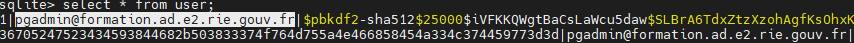

## Informations sur pgAdmin pour les services support
Vous venez d'installer un serveur Eole variante géomatique. Outre la supervision du serveur par le Pôle de Supervision Informatique
National du MTE, cette offre installe les services suivants sur votre serveur :
* un serveur de base de données PostgreSQL comprenant une première base de données nommée par défaut *adl*
* le paramètrage par défaut des accès à ce serveur PostgreSQL
* des scripts effectuant chaque soir un export des différentes bases de données en vue d'une sauvegarde journalière
* la télédistribution d'extensions à PostgreSQL en vue de faciliter son usage, notamment avec [Asgard, outil de gestion des droits](https://spote.developpement-durable.gouv.fr/offre/asgard)
et de [Plume, outil pour la saisie et la consultaion de métadonnées](https://spote.developpement-durable.gouv.fr/offre/plume-metadonnees-d-un-patrimoine-postgresql)
* pgAdmin Server, un outil en mode web de gestion et d'interrogation des objets de PostgreSQL. Cet article aborde l'action relevant du support Informatique
concernant cet outil.

### Initialiser le premier compte de connexion à pgAdmin
L'application pgAdmin Server est accessible à l'adresse *http://adresse_IP_du_serveur/pgamin4*. En tant qu'application web, elle est accessible au travers du VPN pour
les agents en télétravail. Un premier compte de connexion provisoire est créé à l'installation; il est de la forme *pgadmin@domaine-du-serveur* .
Par exemple, pour la DREAL Pays-de-la-Loire, ce compte provisoire serait de la forme *pgadmin@dreal-pdl.ad.e2.rie.gouv.fr*
 Ce compte et son mot de passe sera à fournir au responsable de l'unité géomatique afin qu'il puisse créer les entrées pour les futurs utilisateurs
de l'application 

#### Comment vérifier le nom du 1er compte de connexion à pgAdmin ?
Pour stocker ses informations, pgAdmin s'appuie sur une base de données que l'on trouve dans /var/lib/pgadmin/pgadmin4.db
Pour consulter les informations de cette base et notamment les comptes de connexion stockés, il faut disposer d'un outil capable 
de lire les bases de type SQLite.

Sur le serveur, en mode console, on installe l'outil : *apt install sqlite3*
 On peut désormais éditer la base de comptes de pgAdmin, toujours en mode console : *sqlite3 /var/lib/pgadmin/pgadmin4.db*
 Pour consulter la liste des comptes : *select * from user;* 
 
 
 
 Pour quitter l'éditeur SQLite : *.quit* (ne pas oublier le .)

#### Comment initialiser le mot de passe du 1er compte de connexion à pgAdmin ?
Disposant désormais du compte de connexion par défaut, il faut initialiser son mot de passe. Pour ce faire, en mode console, passer la commande :
 *pgadmin-tool user password nom_du_compte_de_connexion Mot_de_passe*
