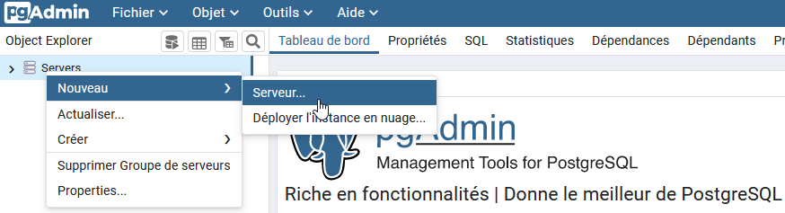

## Connexion à une base de données PostgreSQL
Pour accéder à une base de données, il faut disposer d'une connexion vers celle-çi. Une connexion se compose de plusieurs informations, telles que l'adresse IP du serveur, le rôle de connexion ...
En vous permettant de mémoriser vos différentes connexions vers les bases de données, pgAdmin Server agît comme un gestionnaire de connexions.
A chacune de vos connexions à pgAdmin, vous retrouverez les connexions mémorisées vers vos bases de données PostgreSQL.

### Créer une connexion
Apès vous être connecté à pgAdmin, sur le panneau de droite de l'application, vous disposez d'un menu de création d'une connexion vers une base de données.

La fenêtre de création d'une nouvelle connexion vous propose, au travers de ses différents onglets, de saisir les 
informations nécessaires.

---
Dans l'onglet **Général**, vous renseignerez le champ *Nom* pour identifier la connexion pour le serveur. C'est ce libellé qui sera affiché dans 
l'explorateur d'objets de pgAdmin.

Si *Connecter maintenant ?* est coché (c'est la valeur par défaut), pgAdmin tentera de se connecter à la base de données de votre serveur lorsque vous fermerez cette boîte de dialogue.

Si *Partagé ?* est coché (ce n'est pas la valeur par défaut), la connexion sera partagée entre tous les utilisateurs de pgAdmin.
Cette option n'est disponible que pour les comptes pgAdmin disposant du rôle *Administrator* (cf. xxxx) . Les utilisateurs qui bénéficient de 
cette déclaration partagée de connexion ne pourront pas supprimer cette connexion, ni la renommer ou changer les informations relatives au serveur, port ou base de connexion.

---
C'est réellement dans l'onglet **Connexion** que l'on définit les paramètres nécessaires à une connexion vers une base pour un rôle de connexion PostgreSQL donné.

Le champ *Nom d'hôte* permet de spécifier l'adresse IP du serveur qui héberge les bases de données que vous souhaitez joindre.
Si votre connexion a pour objectif de vous connecter à une base de données hébergée sur le même serveur que celui sur lequel pgAdmin est installé,
vous pouvez indiquer comme adresse *localhost* ou *127.0.0.1*. Si vous souhaitez joindre une base hébergée sur un serveur distant, il faut alors spécifier l'adresse IP du serveur à joindre.

Dans l'offre Eole, le *port* d'écoute du serveur pour PostgreSQL est 5432. C'est la valeur par défaut.

Le champ *Base de données de maintenance* indique le nom de la base de données initiale à laquelle le rôle de connexion se connectera.
Par défaut, l'offre Eole PostgreSQL fournit une première base de données nommée *adl*.

Le champ *Nom utilisateur* attend un rôle de connexion PostgreSQL autorisé à se connecter à la base définie précédemment. Ce rôle de connexion doit être défini dans
PostgreSQL.

Le champ *Mot de passe* est le mot de passe nécessaire au rôle de connexion précédemment défini pour se connecter. Ce mot de passe est géré dans PostgreSQL. En activant *Enregistrer le mot de passe*, vous demandez à pgAdmin de 
sauvegarder ce mot de passe pour une utilisation ultérieure, vous évitant une saisie à chaque demande de connexion. Par souci de sécurité, cette option est désactivée par défaut.

Une fois ces informations saisies, vous pouvez mémoriser votre connexion avec le bouton *Enregistrer*. A chaque nouvelle connexion à pgAdmin, vous
retrouverez vos connexions mémorisées vers PostgreSQL disponibles.
