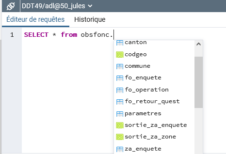

## Utiliser l'éditeur de requête
L'éditeur de requêtes de pgAdmin est un environnement riche en fonctionnalités pour vous permettre d'exécuter des
commandes SQL et de visualiser les résultats. Vous pouvez accéder à l'éditeur de requêtes soit par le menu *Outils --> 
Editeur de requêtes*, soit par l'icône  disponible dans la barre
de l'explorateur dès lors que vous avez sélectioné un objet PostgreSQL (bases, tables, vues...)

 L'éditeur de requêtes vous permet:
1. de rédiger des requêtes SQL et de les exécuter
2. d'afficher les données résultantes de la requête et éventuellement de les exporter dans un fichier CSV
3. d'enregistrer vos requêtes dans un espace qui vous est propre
4. d'analyser une instruction SQL

### Présentation sommaire de l'outil de requête
   

### Rédiger une requête
pgAdmin vous propose deux assistants dans la rédaction de vos requêtes:
1. **la saisie semi-automatique** avec la combinaison de touches Ctrl + Espace afin que l'éditeur vous propose des noms
d'objets ou de commandes qui pourraient être les éléments suivants de votre requête
  
     
2. **l'insertion des noms d'objets** (tables, vues, colonnes) dans votre synthaxe SQL par glisser - déplacer depuis l'
explorateur d'objets vers l'éditeur de requêtes.
     
   

  L'**éxécution de la requête** s'effectue avec le bouton  ou la touche F5
 https://docs.postgresql.fr/10/using-explain.html    
    

### Analyser vos requêtes
Lors de l'exécution d'une requête, PostgreSQL réalise un plan de requête qui influe sur les performances [(cf. documentation Postgresql sur Explain)](https://docs.postgresql.fr/10/using-explain.html).
pgAdmin offre un outil qui génère le plan avec le bouton 
 NB: voir la rubrique relative au noeud Editeur de requête dans la page relative à la personnalisation de pgAdmin pour les éléments d'analyse du plan de requête
 

### Sauvegarder ses requêtes
pgAdmin vous propose de sauvegarder vos requêtes dans votre espace de stockage. Si le compte de connexion à pgAdmin est partagé au sein du service,
l'espace de stockage sera partagé.
 Le bouton  permet d'ouvrir l'espace de stockage, de nommer le ficher
et de l'enregistrer; le bouton  permet d'accéder à l'espace de stockage 
pour sélectionner le fichier contenant la requête afin de l'afficher dans l'éditeur.
 

