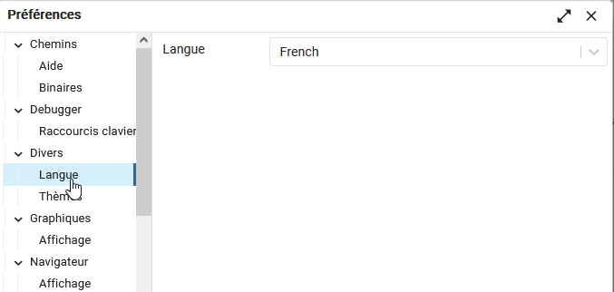
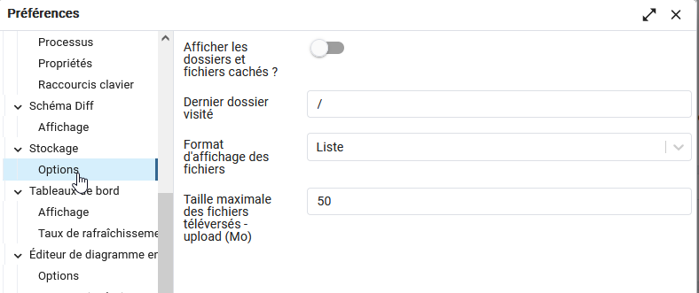
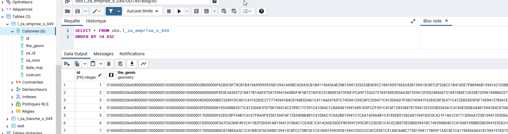
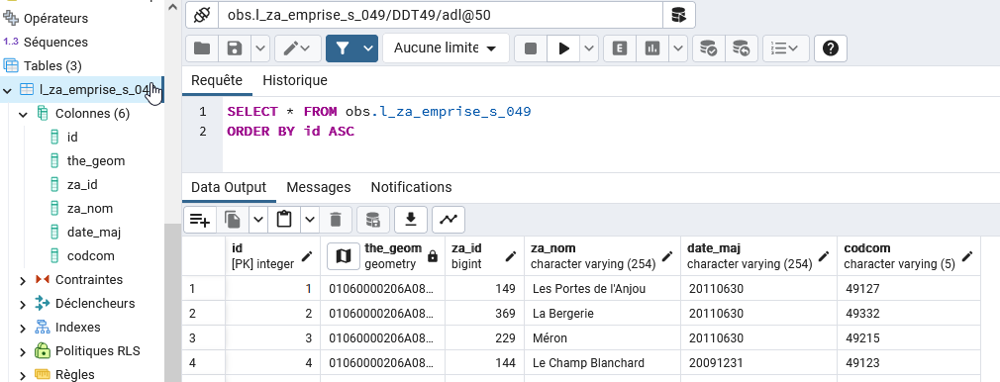
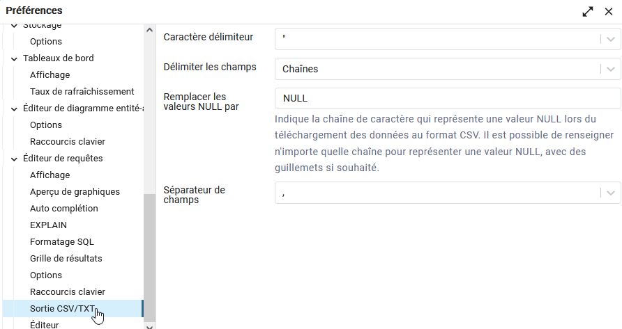

## Personnaliser l'interface de pgAdmin
Vous pouvez Personnaliserl'interface de pgAdmin en utilisant les options présentes dans la boîte de dialogue
*Préférences* disponible dans le menu *Fichier*.
Parmi toutes les options disponibles, quelques unes nous paraissent particulièrement intéressantes.

### Le noeud Divers

Vous pouvez utiliser la liste déroulante pour sélectionner la langue d'affichage de pgAdmin. La prise en compte
s'effectue au redémarrage de l'application.

### Le noeud Stockage
pgAdmin Server vous propose un espace de stockage sur le serveur (cf xxxxx) , accessible en téléversement (dépôt de fichiers)
ou en téléchargement (récupération de fichiers). 

Vous pouvez définir la taille maximale (en Mo) des fichiers à téléverser dans cet espace.

### Le noeud Editeur de requête
L'option **Grille de résultats** vous permet de spécifier vos préférences de formatage pour le tableau de résultats

Par défaut, la valeur est à *Données de la colonne*, ce qui signifie que les colonnes seront dimensionnées pour présenter toutes leurs valeurs. Si votre requête
comprend un champ géométrique parmi les premieres colonnes du tableau résultant, il est probable que vous ne puissiez voir les autres colonnes sans 
utiliser l'ascenseur horizontal.
Exemple: 

En optant pour *Nom de la colonne*, vous verrez l'intégralité de vos colonnes dans le tableau résultant.

L'option **Sortie CSV/TXT** vous permet de choisir le formattage du fichier d'export au format texte des résultats d'une requête

* Le champ *Caractère délimiteur* précise le caractère utilisé pour séparer les valeurs dans le fichier CSV/TXT
* Le champ *Délimiter les champs* permet de choisir si l'on souhaite récupérer les champs de type *Chaînes* (chaîne de caractères), *Tout* (tous les types de champs) ou *Aucune* (je ne veux pas
récupérer les noms de champs)
* Le champ *Séparateur de champs* pour indiquer quel séparateur doit être utilisé pour séparer les noms de champs dans le fichier CSV/TXT

 L'option **EXPLAIN** permet de définir quels seront les éléments analysés dans le plan de requête que PostgreSQL met en oeuvre afin d'évaluer les performances. A 
minima, il est suggéré d'activer l'affichage du chronomètre et le coût.
